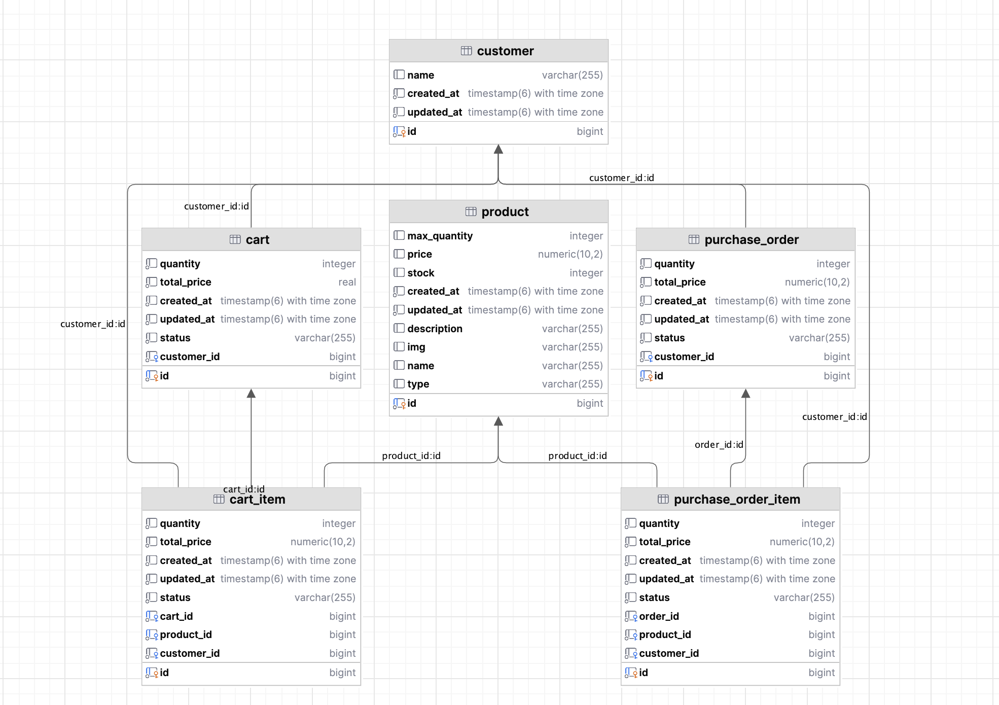

# MapleOrdersApi

## Data model vision and technical choices

### Explaination

**From a Customer point of view** :

- Customer has many CartItem
- Customer has many Cart
- Customer has many Order
- Customer has many OrderItem

**From a Product point of view** :

- Product has many CartItem
- Product has many OrderItem

**From a Cart point of view** :

- Cart has many CartItem
- Cart has one Customer

**From an Order point of view** :

- Order has many OrderItem
- Order has one Customer

### Diagram

### Technical choices

#### Why use polymorphism to create entities? And why these object inherit from TransactionEntity

rimarily, it was a way to simplify the creation of entities. `Cart`, `CartItem`, `Order`, and `OrderItem` inherit from
`TransactionEntity` because they all involve product purchases. The fields in `TransactionEntity` are mostly metadata,
such
as `createdAt` and `updatedAt` (in `BaseEntity`). However, this structure also aligns with the broader vision. I plan to
implement statistical
features for customers, as well as for carts and orders. For example, calculating the average total cart price by day
and by customer, or identifying the top 3 ordered products. We could even imagine sending a customer's favorite product
on their birthday, for example.

#### Separation of the Cart and Order tables to differentiate their uses

We can consider these use cases for the cart: saving carts to keep a product aside for a certain number of minutes, for
example. And for the order: adding the contents of a new cart to an undelivered order.